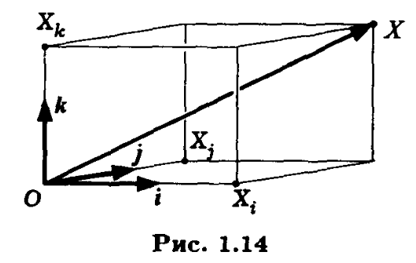
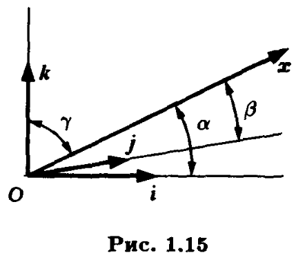
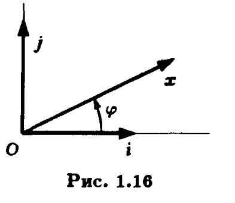

# Базис
* Рассмотрим три пространства свободных векторов: V1 - пространство коллинеарных векторов, V2-пространство компаланрых векторов и пространство V3.
* В пространстве V1 любой не нулевой вектор е называют <b>базисом</b>, все вектора выражаются через него в виде
$x=\lambda{e}$  <b>это равенство называют разложением вектора x в базисе е, а число $\lambda$ - координатой вектора х в базисе е.</b>
* В пространстве V2 любую упорядоченную пару неколлинеарных не нулевых векторов называют <b> базисом в V2</b>. Выберем два не нулевых не коллинеарных вектора $e_1 e_2$ в качестве базиса. Т.к. все вектора V2 компланарны, то все три вектора линейно зависимы:
 
$\alpha{x}+\beta_1{e_1}+\beta_2{e_2}=0$
 
причем $\alpha \ne 0$ потому что в противном случае следует что вектора $e_1 e_2$ линейно зависимы те коллинеарны.
Перенеся часть слагаемых влево и поделив на $\alpha \ne0$ получим равенство:
 
$$x=\lambda_1{e_1}+\lambda_2{e_2}$$
Которое называют <b> разложением x в базисе $e_1e_2$ с координатами $\lambda_1,\lambda_2$.</b>
Координаты определяются единственным образом, если бы это было не так, то:
$$x=\lambda_1{e_1}+\lambda_2{e_2} = \mu_1{e_1}+\mu_2{e_2}$$
Вычтем равенства и используем свойство дистрибутивности произведения векторов на числа:
 $$(\lambda_1-\mu_1){e_1}+(\lambda_2-\mu_2){e_2} = 0 $$
 Т.к. вектора линейно не зависимы, то
$$\lambda_1=\mu_1,\lambda_2=\mu_2 $$
* V3: Любую тройку не нулевых и не компланарных векторов называют <b>базисом в V3.</b> Выберем в качестве базиса вектора $e_1,e_2,e_3$ не компланарные и не нулевые. Т.к. любые четыре вектора линейно зависимы можно написать:
$$x = \lambda_1{e_1}+\lambda_2{e_2}+\lambda_3{e_3}\qquad(1.5)$$
Коэффициенты в разложении определены единственным образом т.к. базисные вектора не компланарны. Полученное равенство называют <b>разложением вектора x в базисе $e_1,e_2,e_3$,а коэффициенты разложения $\lambda_1,\lambda_2\lambda_3$ координатами вектора в этом базтсе</b>.
* Базисные вектора упорядочены, упорядочены и коэффициенты разложения векторов, поэтому любой вектор можно описать упорядоченным набором чисел в соотв. базисе:
$$x=\{-2;3;5\}$$
# Вычисления в координатах
* Т1.7:<b> При сложении векторов их соотв координаты складываются, при умножении на число - умножаются на это же число</b>

$\Delta$
Выберем базис $e_1,e_2,e_3$ и два произвольных вектора
  $$x=x_1e_1+x_2e_2+x_3e_3\quad y=y_1e_1+y_2e_2+y_3e_3$$
Используем дистрибутивность умножения вектора на число относительно чисел:
 $$x+y=(x_1+y_1)e_1+(x_2+y_2)e_2+(x_3+y_3)e_3$$
Из равенства следует, что сумма векторов равна сумме их координат в выбранном базисе.
Произведение вектора на число:
 $$\lambda{x}=\lambda(x_1e_1+x_2e_2+x_3e_3)$$
Используя свойства линейных операций (дистрибутивность и ассоциативность)получим:
 $$\lambda{x}=(\lambda{x_1})e_1+(\lambda{x_2})e_2+(\lambda{x_3})e_3$$
каждая из координат вектора умножена на $\lambda$.
$\Delta$
* Разложение вектора по координатам имеет простой геометрический смысл, выберем в качесте базиса вектора a,b,c и разложим по ним вектор d:

 $$d_a=\pm\left|\frac{OA'}{OA}\right|,d_b=\pm\left|\frac{OB'}{OB}\right|,d_c=\pm\left|\frac{OC'}{OC}\right|$$
 Знаки выбираются в зависимости от направления векторов OC и OC' и т.д.
 * Т1.8:<b>Для того, чтобы два вектора были коллинеарны необходимо и достаточно чтобы их одноименные координаты были пропорциональны.</b>

$\Delta$
Достаточность: рассмотрим 2 вектора с пропорциональными координатами:
$$x_1=\lambda{y_1}\quad x_2=\lambda{y_2}\quad x_3=\lambda{y_3}\qquad(1.7)$$
$$x=x_1e_1+x_2e_2+x_3e_3\quad \lambda{y}=\lambda{y_1e_1}+\lambda{y_2e_2}+\lambda{y_3e_3}$$
или
$$x=\lambda{y}$$
Из последнего равенста по Т1.4 следует, что вектора x и y коллинеарны.
Необходимость: Предположим что вектора x,y коллинеарны, по Т1.4 следует, что они линейно зависимы:
$$x=\lambda{y}$$
Используя свойства линейных операций получим:
$$x=x_1e_1+x_2e_2+x_3e_3=\lambda{y}=\lambda{y_1e_1}+\lambda{y_2e_2}+\lambda{y_3e_3}$$
$$x-\lambda{y}=(x_1-\lambda{y_1})e_1+(x_2-\lambda{y_2})e_2+(y_3-\lambda{x_3})e_3=0$$
т.к. все координаты нулевого вектора равны нулю, то получаем равенство (1.7).
$\Delta$
* Следствие 1.1:<b>Для того, чтобы 2 вектора были коллинеарны необходимо и достаточно чтобы отношения их соотв. координат были равны.</b>

$\Delta$
Из равенства 1.7 следует, что:
$$\frac{x_1}{y_1}=\frac{x_2}{y_2}=\frac{x_3}{y_3}$$
Знаменатели могут быть нулевыми, тогда считаем нулевым и числитель.
$\Delta$
* О1.9:<b>Базис называется ортогональным, если он состоит из векторов, лежащих на перпиндикулярных прямых.Базис называют ортонормированным, если он ортогональный и состоит из единичных векторов.</b>
* Координаты вектора в ортонормированом базисе равны ортогональным проэкциям вектора на соотв. оси.
* Вектора базиса обозначают с учетом порядка как i,j,k
* Найдем расстояния от начала координат до произвольной точки X в ортонормированном базисе.

По теореме Пифагора:
$$OX^2=OX_i^2+OX_j^2+OX_k^2$$
$X_i,X_j,X_k$ - ортогональные проекции точки X на соотв оси. $OX_i,OXj,OX_k$ - это абсолютные значения координат вектора $x=\vec{OX}$,тогда модуль (длинна вектора) $x=\{ x_1,x_2,x_3\}$:
$$|\vec{x}|=\sqrt{x_1^2+x_2^2+x_3^2}\quad x\in{V_3}\qquad (1.9)$$
$$|\vec{x}|=\sqrt{x_1^2+x_2^2}\quad x\in{V_2}\qquad (1.10)$$
$$|\vec{x}|=\sqrt{x_1^2}\quad x\in{V_1}=|x_1|\qquad (1.11)$$
* Пусть не нулевой вектор x из V3 образует с направлениями векторов ортонормированного базиса углы $\alpha,\beta,\gamma$ для ортов i,j,k соответственно.

* O:Величины $cos(\alpha),cos(\beta),cos(\gamma)$ называют <b>направляющими косинусами вектора x</b>.
* Направляющие косинусы можно использовать для вычисления координат не нулевого вектора $\vec{x}\in{V_3}\quad{x=\{x_1,x_2,x_3\}}$ с направляющими косинусами $cos(\alpha),cos(\beta),cos(\gamma)$:
$$x_1=|x|cos(\alpha),x_2=|x|cos(\beta),x_3=|x|cos(\gamma)\qquad(1.12)$$
Используя формулу 1.9 для длинны вектора, получаем:
$$|x|^2=|x|^2cos(\alpha)^2+|x|^2cos(\beta)^2+|x|^2cos(\gamma)^2$$
Сократив на не нулевой |x| получим формулу для связи направляющих косинусов:
$$cos(\alpha)^2+cos(\beta)^2+cos(\gamma)^2=1\qquad(1.13)$$
* Направляющие косинусы определяют только направление вектора, при умножении вектора на число они не изменяются. Для однозначного определения вектора требуется длина вектора и его направляющие косинусы.
* В случае ортонормированного базиса в V2 удобно направление вектора выражать одним углом $\varphi$, который отсчитывается от орта i против хода часовой стрелки.

$x=\{x_1,x_2\}\quad{x_1=|x|cos(\varphi)}\quad{x_2=|x|sin(\varphi)}$
