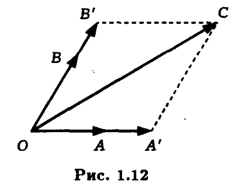
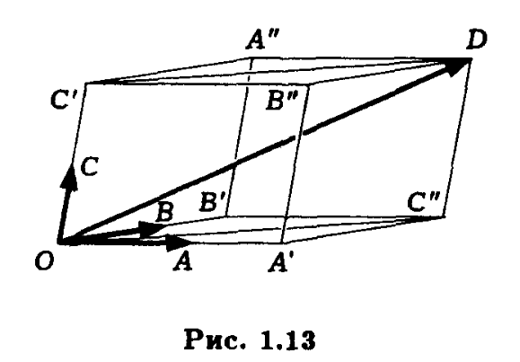

# Линейная зависимость и независимость векторов
О: Линейной комбинацией векторов называют выражение
$$\sum_{i=0}^n\alpha_ia_i$$
где $\alpha_i$ - произвольные действительные числа, а $a_i$ вектора. Числа $\alpha_i$ называют <b>коэффициентами линейной комбинации</b>.
* Если любой вектор может быть представлен в виде линейной комбинации данной системы векторов и притом единственным образом то мы можем интерпретировать вектор как набор соотв.коэффициентов и работать с ним алгебраическими методами.
* O1.8:<b>Векторы $a_1 ... a_n$ называются динейно зависимыми </b>, если существует такой набор коэффициентов, что  $\sum_{i=0}^n\alpha_ia_i = 0$
и при этом хотябы один коэффициент не равен нулю. Иначе вектора называются <b>линейно не зависимыми</b>.
* T1.3:<b>Для того, чтобы вектора были линейно зависимыми необходимо и достаточно, чтобы один из векторов был линейной комбинацией остальных.</b>

$\Delta$
Необходимость. Предположим, что вектора линейно зависимы, тогда один из коэффициентов обязательно не равен нулю, например коэф $\alpha_1$, тогда верно равенство:
$a_1$=$-\frac{\alpha_2}{\alpha_1}a_2$ + ...
т.о. вектор $a_1$ является линейной комбинацией остальных векторов.

Достаточность.Если один из векторов является линейной комбинацией остальных $a_1$=$-\frac{\alpha_2}{\alpha_1}a_2$ + ...
то $a_1$ + $\frac{\alpha_2}{\alpha_1}a_2$ + ...=0
т.е. вектора являются линейно зависимыми.
* T1.4:<b> Два вектора линейно зависимы тогда и только тогда, когда они коллинеарны.</b>

$\Delta$
Пусть вектора a и b линейно зависимы, из этого следует, чтоб a=$\lambda b$ то вектора a и b коллинеарны по О1.7.

Пусть вектора a и b коллинеарны, тогда верно равенство a=$\lambda b$ или a-$\lambda b$=0 то вектора a и b линейно зависимы тк коэф при векторе а не равен нулю.
* Удобно использовать T1.4 как критерий коллинеарности 2-х векторов.
* T1.5<b>Три вектора зависимы тогда и только тогда, когда они компланарны.</b>

$\Delta$
Пусть вектора a,b,c линейно зависимы, тогда верно равенство a=$\beta{b}+\gamma{c}$. Тогда a является суммой двух векторов и по правилу треугольника или параллелограмма все они лежат в одной плоскости.
 
Предположим теперь что a,b,c компланарны. Совместим начала векторов в точке O. Точками A,B,C обозначим их концы (см рис.1.12 ) 
$\vec{OB'}$=$\beta\vec{OB}$,$\vec{OA'}$=$\alpha\vec{OA}$
 
OB'CA' представляет собой параллелограмм и по определению суммы векторов $\vec{OC}=\vec{OB'}+\vec{OA'}$
или $c=\beta{b}+\alpha{a}$ => вектора a,b,c линейно зависимы по Т1.3.
* T1.6<b>Любые четыре вектора линейно зависимы.</b>

$\Delta$
Рассмотрим вектора a,b,c,d если один из них нулевой,либо два из них коллинеарны, либо 3 из них компланарны, то можно доказать теорему легко - например взяв не нулевой коэф для нулевого вектора. Опустим эти случаи и совмести начала всех векторов в точке O 
Полученная фигура представляет собой параллелипипид, вектора a,b,c лежат на его гранях.
$\vec{OC''} = \alpha{a}+\beta{b}$
 
$\vec{OD}=d=\vec{OC''}+\gamma{c}=\gamma{c}+\alpha{a}+\beta{b}$
Т.о. получается что вектор d является линейной комбинацией остальных векторов, тогда все вектора по Т1.3 линейно зависимы.
$\Delta$
