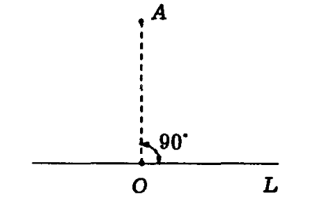
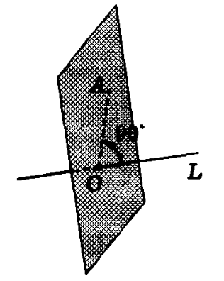
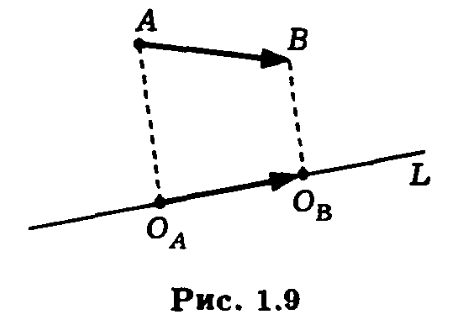
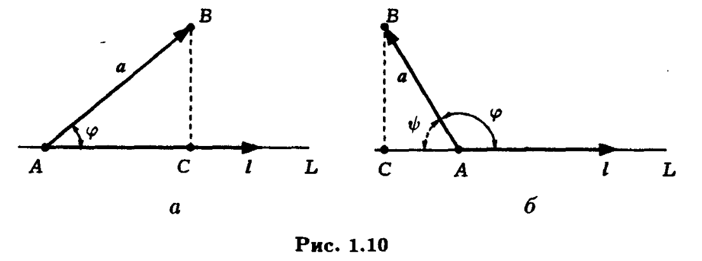
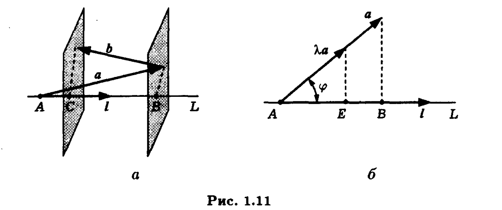

# Ортогональная проекция
* О:Пусть на плоскости заданы прямая L и точка A, опустим перпиндикуляр из точки А на прямую L,
полученная точка O называется <b>ортогональной проекцией точки A на прмямую L</b>.

* O:Если точка A и прямая L заданны в пространстве, то ортогональной проекцией O будет называться точка пересечения прямой с перпиндикулярной ей плоскостью, на которой лежит точка A.  

* Для вектора $\vec{AB}$ на плоскости или в пространстве можно построить ортогональные проекции его начала и конца
OA и OB, тогда вектор $\vec{O_AO_B}$
называют <b>ортогональной проекцией вектора $\vec{AB}$ на прямую L</b>.

* O: <b>Ось</b> - это прямая на которой заданно одно из двух направлений.
* Ортоганальную проекцию $\vec{O_AO_B}$ можно полностью описать длинной вектора $\vec{O_AO_B}$ и знаком, определяющим направление проекции на прямой.
* O: Длинну вектора $\vec{O_AO_B}$ со знаком, определяющим направление вектора на оси называют ортогональной проекцией вектора $\vec{AB}$ на ось l и
обозначают как $\mathbf{пр_la}$
* Ортогональная проекция вектора на прямую является вектором, а на ось - числом.
* Каждый не нулевой вектор определяет ось на которой он лежит,ортогональную проекцию вектора на такую ось называют <b>ортогональной проекцией вектора на направление l</b>.
* O: Углом между векторами называют угол между их направлениями. Угол может изменяться в пределах [0,$\pi$], 0 - коллинеарные сонаправленные вектора,$\pi$ - коллинеарные противоположно направленные вктора.
* T1.1: Ортогональня проекция вектора a на направление не нулевого вектора l равна длинне вектора а помноженной на косинус между вектором а и направлением l:
$пр_la$ = $|a|*cos(a,l)$
$\Delta$
Пусть вектор l лежит на прямой L, совместим начало вектора а с точкой A,конец вектора а обозначим точкой B и построим ортогональную проекцию точки B на прямую L и обозначим ее точкой C. Тогда $\vec{AC}$ будет ортогональной проекцией вектора а на прямую L.

Если угол $\varphi$ острый то $пр_la$ = |AC|=$|a|*cos(\varphi)$. Если же угол $\varphi$ тупой то
$пр_la$ = -|AC|=$|a|*cos(\pi-\varphi)$=-$|a|cos(\varphi)$
$\Delta$
* T1.2: Ортогональная проекция суммы векторов на направление не нулевого вектора l равна сумме их ортоганальных проекций,при умножении вектора на число его ортоганальная проекция на не нулевой вектор умножается на это число.
$пр_l(a+b)$=$пр_la+пр_lb$  
$пр_l\lambda{a}$ = $\lambda{пр_la}$

$\Delta$

$пр_la$=|AB|, $пр_lb$=-|BC|, $пр_l(a+b)$=|AC|=|AB|-|BC|;
 
AE=$пр_l\lambda{a}$=|AB|*$\lambda$(подобие треугольников) = $\lambdaпр_la$
$\Delta$
