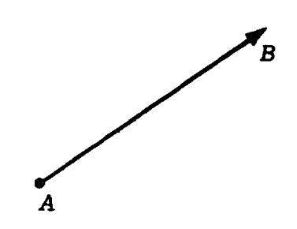
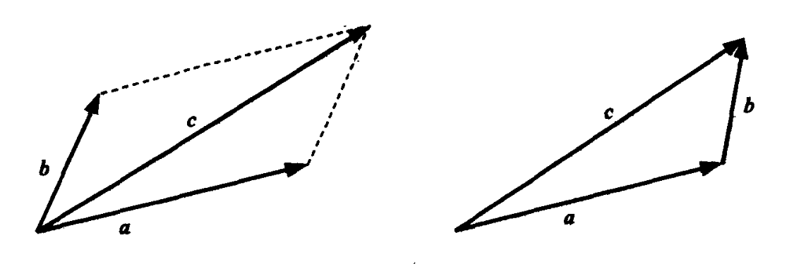
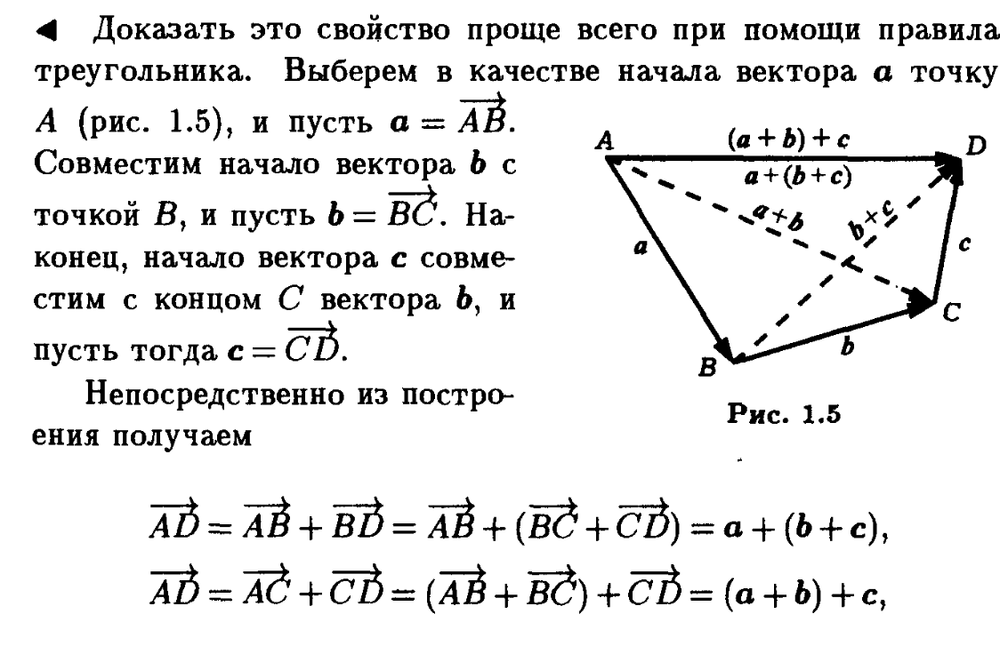
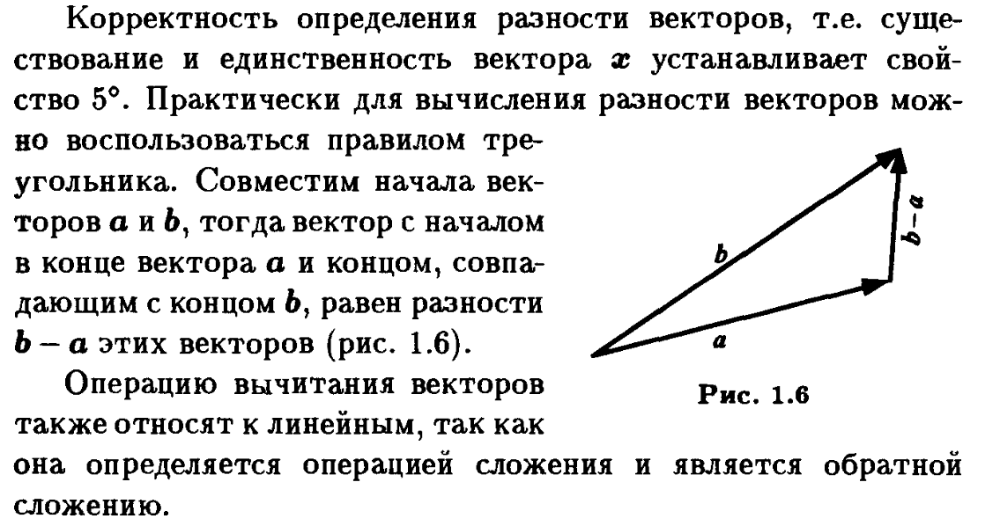
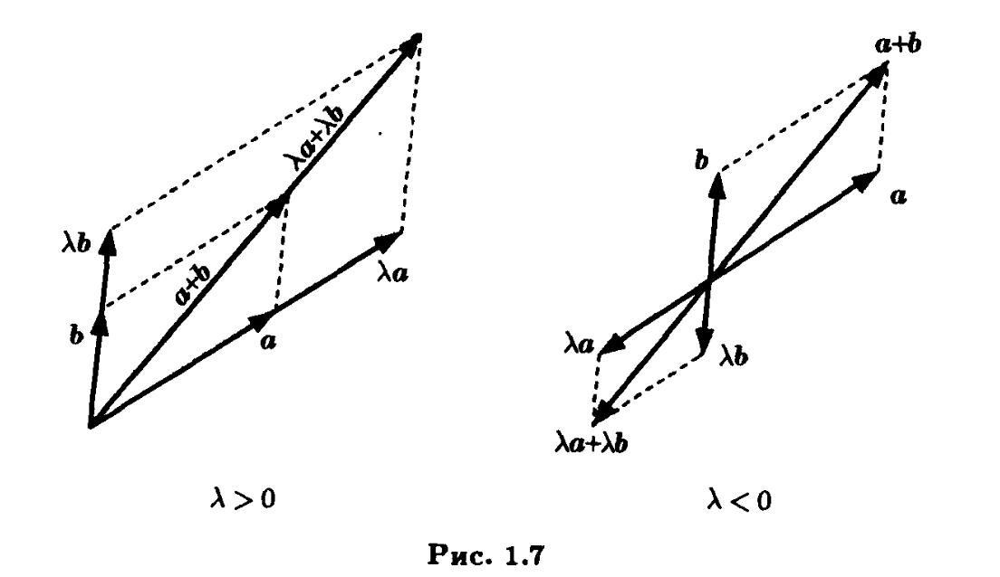

* Скалярная величина - определяется значением относительно некоторого эталона (п - масса)
* Векторная величина - определяется значением и направлением (скорость)
* Геометрический вектор - это любой отрезок с заданным направолением. Первая точка в паре называется началом,
а вторая концом вектора.
* Начало геометрического вектора называют точкой его приложения.

* Обозначают такой вектор как $\vec{AB}$
* Длинна вектора или модуль вектора - это длинна отрезка, обозначается |AB|
* Вектор называют не нулевым, если его длинна <> 0, иначе вектор называют нулевым и обозначают как 0.
У нулевого вектора направление отсутствует.
* Если длинна вектора = 1, то его называют ортом или единичным.
* Два вектора называют коллинеарными, если они лежат на одной или на параллельных прямых.
* Три геометрических вектора называют компланарными, если они лежат на прямых, параллельных одной плоскости.
* Два вектора называют равными, если они коллинеарны, сонаправленны и имеют одинаковую длинну.
* О:1.5 Суммой векторов a+b называют вектор $\vec{c}$ построенный по правилу параллелограмма или треугольника.

### T1: сложение векторов коммутативно:
a+b=b+a

$\Delta$
Д-во вытекает из правила параллелограмма т.к. порядок сложения векторов тут не важен
$\Delta$
### T2: сложение векторов ассоциативно:
(a+b)+c=a+(b+c)

### Т3: Существует такой вектор 0, что a+0=a
$\Delta$
Легко проверить используя правило треугольника.
0- нулевой вектор
$\Delta$
### Т4: Для любого вектора a найдется такой вектор b, что a+b=0
$\Delta$
a+(-a)=0
-a коллиниарный противоположно направленный вектор той же длинны что и а - по правилу треугольника складывая их получим нулевой вектор.
$\Delta$
### T5: Для любых векторов а и b найдется такой однозначтно определенный вектор вектор x, что a+x=b.
$\Delta$
x=(-a)+b

a+((-a)+b)=(a+(-a))+b=b (следует из ассоциативности)
$\Delta$
* O1.6: Разностью двух b-a называют вектор x, такой,что a+x=b.
Алгебраически это значит, что при переносе вектора в другую часть равенства следует менять его знак
x=b-a.

* O1.7: Произведением вектора a на число $\lambda$ называют вектор  $\lambda$a с длинной |$\lambda$||a|
коллинеарный вектору а.
* (-1)a=-a дает вектор противоположный вектору a.
### T6: Умножение вектора на число ассоциативно ($\lambda$$\mu$)a=$\lambda$($\mu$a)
$\Delta$
($\lambda$$\mu$)a и $\lambda$($\mu$a) коллинеарные, сонаправленнве вектора одинаковой длинны, следовательно они равны.
$\Delta$
### T7: Умножение вектора на число дистрибутивно относительно векторов: $\lambda$(a+b)=$\lambda$a+$\lambda$b.

### T8: Умножение вектора на число дитрибутивно относительно чисел:($\lambda$+$\mu$)a=$\lambda$a+$\mu$a
$\Delta$
Все вектора коллинеарны. Перебрав все варианты знаков $\lambda$ и $\mu$ получим слева и справа соноправленные вектора одинаковой длинны - т.е. равные вектора.
$\Delta$
