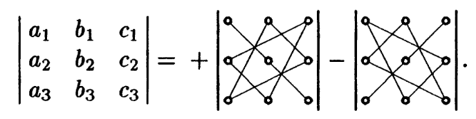

# Определители второго и третьего порядков
* О:<b>Определителем второго порядка</b> называют выражение $a_1b_2-b_1a_2$, где ab - числа и записывают в виде:
$$
\begin{vmatrix}
a_1&b_1\\
a_2&b_2
\end{vmatrix}=a_1b_2-b_1a_2\qquad(2.1)$$
* O:<b>Главная диагональ</b> определителя $a_1b_2$,<b>побочная диагональ</b> определителя $b_1a_2$
* Определитель второго порядка равен произведению элементов главной диагонали минус произведене элементов побочной диагонали.
* О:<b>Определителем третьего порядка</b> называют выражение:
$$
\begin{vmatrix}
a_1&b_1&c_1\\
a_2&b_2&c_2\\
a_3&b_3&c_3
\end{vmatrix}=a_1b_2c_3+b_1c_2a_3+a_2b_3c_1-a_3b_2c_1-a_2b_1c_3-a_1b_3c_2\qquad(2.2)$$
* Определитель третьего порядка так же имеет главную и побочную диагонали.
* Для запоминания используют правило <b>треугольника</b> - со знаком плюс берем произведение элементов главной диагонали и произведение элементов, лежащих на параллелях к этой диагонали. Со знаком минус берем произведение эелементов побочной диагонали и произведения элементов, лежащих на параллелях к побочной диагонали:

* Вычисление определителя третьего порядка можно свести к вычислению определителей второго порядка. Все слагаемые содержат в себе элементы первой строки $a_1b_1c_1$ воспользуемся этим:
$$
\begin{vmatrix}
a_1&b_1&c_1\\
a_2&b_2&c_2\\
a_3&b_3&c_3
\end{vmatrix}=a_1b_2c_3+b_1c_2a_3+a_2b_3c_1-a_3b_2c_1-a_2b_1c_3-a_1b_3c_2$$
$$=a_1(b_2c_3-c_2b_3)+b_1(a_2c_3-c_2a_3)+c_1(a_2b_3-b_2a_3)$$
$$=
a_1\begin{vmatrix}
b_2&c_2\\
b_3&c_3
\end{vmatrix}-
b_1\begin{vmatrix}
a_2&c_2\\
a_3&c_3
\end{vmatrix}+
c_1\begin{vmatrix}
a_2&b_2\\
a_3&b_3
\end{vmatrix}
\qquad(2.4)
$$
* Соотв определители получаются вычеркиванием строки и столбца которым принадлежит элемент первой строки, знаки определителей чередуются, начиная со знака +.
* Определители находят применение в решении систем линейных уравнений:
$$
\begin{cases}
a_1x+b_1y=c_1 \\
a_2x+b_2y=c_2 \\
\end{cases}\qquad(2.5)
$$
* Решим систему методом исключения неизвестных, первое уравнение домножим на $-a_2$, второе на $a_1$ и сложим их:
$$-a_2a_1x-a_2b_1y+a_1a_2x+a_1b_2y=-a_2c_1+a_1c_2$$
$$y=\frac{a_1c_2-a_2c_1}{a_1b_2-a_2b_1}$$
$$y=\frac{\Delta_y}{\Delta}, x=\frac{\Delta_x}{\Delta}$$
$$\Delta=\begin{vmatrix}
a_1&b_1\\
a_2&b_2
\end{vmatrix},
\Delta_x=\begin{vmatrix}
c_1&b_1\\
c_2&b_2
\end{vmatrix},
\Delta_y=\begin{vmatrix}
a_1&c_1\\
a_2&c_2
\end{vmatrix}\qquad(2.6)$$
* $\Delta$ - определитель системы второго порядка, если
$\Delta\ne0$, то система уравнений имеет единственное решение описанное в (2.6),определители $\Delta_x$,$\Delta_y$ получаютя заменой столбца коэф при соответствующем неизвестном на столбец свободных членов в (2.5).
* Решение системы в виде (2.6) называют формулами Крамера.
* Аналогичным образом через определители третьего порядка решается система с 3-мя неизвестными.
