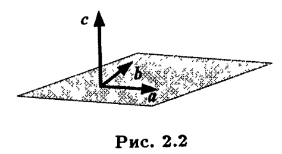

# Векторное произведение
* O2.2:Упорядоченную тройку некомпланарных векторов a,b,c называют <b>правой</b>,если направлене вектора a совмещается с направлением вектора b при помощи кратчайшего поворота в плоскости ab,который со стороны вектора c совершается против часовой стрелки (правый винт). В случае кратчайшего поворота по часовой стрелки тройку векторов называют <b>левой</b>.
* Все базисы в V3 подразделяются на 2 класса: левые и правые,класс, к которому принадлежит базис называют его <b>ориентацией</b>.
* O2.3: <b>Векторным произведением</b> векторов a и b называется вектор с, удовлетворяющий условиям:
  1. Вектор c ортогонален векторам а и b
  2. |c|=|a||b|sin(a,b)
  3. Упорядоченная тройка векторов a,b,c является правой.
  
  Обозначается векторное произведение так:
  $$c=a\times b$$
* Если вектора a,b коллинеарны, то условие 3 не имеет смысла, а по условию 2 |c|=0 т.о. в случае коллинеарных векторов a и b их векторным произведением будет нуль-вектор.
* Свойство 1: Для того, чтобы пара векторов была коллинеарна необходимо и достаточно, чтобы их векторное произведение равнялось нуль-вектору.

$\Delta$
Необходимость:|c|=|a||b|sin(a,b)=0 => угол м\у векторами а и b равен 0 или $\pi$.
 
Достаточность:|c|=|a||b|sin(a,b)=0 т.к. a и b коллинеарны.
Если a или b равны нуль-вектору, то a и b коллинеарны т.к. нуль вектор коллинеарен любому вектору.
$\blacktriangle$
